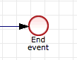
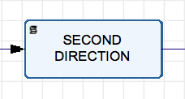

## Synopsis

At the top of the file there should be a short introduction and/ or overview that explains **what** the project is. This description should match descriptions added for package managers (Gemspec, package.json, etc.)

## Motivation

A short description of the motivation behind the creation and maintenance of the project. This should explain **why** the project exists.

## Installation

To use PHP SDK in your code create or add into your composer.json file the following:
 
```
{
  "minimum-stability": "dev",
  "repositories": [
    {
      "type": "git",
      "url": "https://github.com/colosa/pmio-sdk-php.git"
    }
  ],
  "require": {
    "colosa/pmio-sdk-php": "1.0.0.x-dev"
  }
}
```

and run `composer install`.

Don't forget to use composer auto-loader by including the following at the top of your script:
```php
require_once __DIR__ . '/vendor/autoload.php';
```

## SDK Initialization

```php
use Swagger\Client\Api\ProcessmakerApi;

/** @var ProcessmakerApi $apiInstance */
$apiInstance = new ProcessmakerApi;

$host = '_DEFINE_API_HOST_';
$key = '_DEFINE_AUTHORIZATION_KEY_';

$apiInstance->getApiClient()->getConfig()->setHost("http://$host/api/v1");
$apiInstance->getApiClient()->getConfig()->setAccessToken($key);

/** Optionally you may enable logging */

$apiInstance->getApiClient()->getConfig()->setDebugFile('my_debug.log');
$apiInstance->getApiClient()->getConfig()->setDebug(true);
```

## Code Example

### How to create a new user

```php
/** Setting required attributes for user Bob*/

/** @var UserAttributes $bobAttr */
$bobAttr = new UserAttributes();
$bobAttr->setLastname('Doe');
$bobAttr->setFirstname('Bob');
$bobAttr->setUsername('Bob');
$bobAttr->setPassword('Bobpassword');
$bobAttr->setEmail('bob@processmaker.com');

    /** get client secret and ID */

    /** @var UserItem $bob */
    $bob = $apiInstance->addUser(new UserCreateItem([
        'data' => new User(['attributes' => $bobAttr])
    ]));
```

From the result you may retrieve `client_id` 

`print_r($bob->getData()->getAttributes());`

This `client_id` required to obtain `client_secret` and then you will be able to perform Oauth authorization key

#### Retrieving client_secret

```php
/** Getting additional credentials to get access token for created users */
    /** @var ClientItem $bobCredentials */
    $bobCredentials = $apiInstance->findClientById($bob->getData()->getId(), $bob->getData()->getAttributes()->getClients()[0]);
    print_r($bobCredentials);
```

Here you may retrieve `client_secret`.

#### Getting authorization key

Having both `client_id` and `client_secret` you may retrieve `access_token` using *password grant*.
Additionally `username` and `password` are required to perform the operation.

```php
$args_for_bob = [
    'grant_type' => 'password',
    'client_id' => $bobCredentials->getData()->getId(),
    'client_secret' => $bobCredentials->getData()->getAttributes()->getSecret(),
    'username' => $bobAttr->getUsername(),
    'password' => $bobAttr->getPassword()
];

print_r(getCredentials($args_for_bob, $host));

/**
 * @param array $args Oauth request data
 * @param string $host API HOST
 * @return mixed
 */
function getCredentials($args, $host)
{
    $ch = curl_init();
    curl_setopt($ch, CURLOPT_URL, "http://$host/oauth/access_token");
    curl_setopt($ch, CURLOPT_POST, 1);
    curl_setopt($ch, CURLOPT_POSTFIELDS, http_build_query($args));
    curl_setopt($ch, CURLOPT_RETURNTRANSFER, true);
    $serverResponse = json_decode(curl_exec($ch));
    curl_close($ch);
    return $serverResponse;
}

```

Here you will get `access_token` and `refresh_token` to perform Oauth authorization for specific user.

## How to create and launch a new process

Executing code snippet below creates a new **Process**

```php
    /** @var ProcessAttributes $processAttr */
    $processAttr = new ProcessAttributes();

    $processAttr->setStatus('ACTIVE');
    $processAttr->setName('Example process '.$random);
    $processAttr->setDurationBy('WORKING_DAYS');
    $processAttr->setType('NORMAL');
    $processAttr->setDesignAccess('PUBLIC');

    /** @var ProcessItem $result */
    $process = $apiInstance->addProcess(new ProcessCreateItem(
            [
                'data' => new Process(['attributes' => $processAttr])
            ]
        )
    );
```

As result we get process_id, which we can use in future to add objects to our **Process** ``php  $process->getData()->getId();``.

### How to assign user to task

To run process, we should create new **Group** and attach existing **User** to that group
````php
/** @var GroupAddUsersItem $groupAddUserItem */
$groupAddUserItem = new GroupAddUsersItem([
     'data' => new UserIds([
         'users' => [$apiInstance->myselfUser()->getData()->getId()]
      ])
  ]);
$apiInstance->addUsersToGroup($group->getData()->getId(), groupAddUserItem);
````
### How to add objects to process
Also we should add objects to our process,  such as **Start event**  and **End event**: ``$apiInstance->addEvent()``, and at least one  **Task** object ``$apiInstance->addTask()``.

### How to add flows between process objects

All objects in **Process** need to be joined by **Flows** ``$apiInstance->addFlow()`` with each other.

### How to delegate User to Task

Now we have `process id`, `task id` and `group id` and can assign **Task** to **Group** with following method:
```
 /** @var TaskAddGroupsItem $taskAddGroupsItem */
 $taskAddGroupsItem = new TaskAddGroupsItem([
     'data' => new GroupIds([
         'groups' => [$group->getData()->getId()]
     ])
 ]);
$apiInstance->addGroupsToTask(
       $process->getData()->getId(),
       $userTask->getData()->getId(),
       $taskAddGroupsItem
       );
```
### How to run process

To run process we just need to trigger **Start event** object by following snippet.

```php
 /** @var array $arrayContent */
     $arrayContent = ['key' => 6, 'add' => 15, 'confirm' => false];
     /** @var DataModelAttributes $dataModelAttr */
     $dataModelAttr = new DataModelAttributes();
     $dataModelAttr->setContent(json_encode($arrayContent));
     /** @var DataModelItem $result */
     $result = $apiInstance->eventTrigger(
         $process->getData()->getId(),
         $startEvent->getData()->getId(),
         new TriggerEventCreateItem(
             [
                 'data' => new DataModel(['attributes' => $dataModelAttr])
             ]
         )
     );

```

Just pass ``$process->getData()->getId()`` **Process** id and ``$startEvent->getData()->getId()`` **Start event** id and in body **Data model** any content that we need during running **Process** just putting into associative array keys and values ``$arrayContent = ['key' => 6, 'add' => 15, 'confirm' => false];``.

As result, our engine creates **Process instance** with status **RUNNING**.
To get all instances belonging to process we can retrieve using ``$apiInstance->findInstances($process->getData()->getId())`` method.


## How to use Exclusive gateway and conditional flows (2 examples)

### Example #1

First of all we need to create **Process** and fill it with objects.

### Create **Process** with random name


```php
/** @var ProcessAttributes $processAttr */
    $processAttr = new ProcessAttributes();

    $processAttr->setStatus('ACTIVE');
    $processAttr->setName('Example process '.$random);
    $processAttr->setDurationBy('WORKING_DAYS');
    $processAttr->setType('NORMAL');
    $processAttr->setDesignAccess('PUBLIC');
    /** @var ProcessItem $result */
    $process = $apiInstance->addProcess(new ProcessCreateItem(
            [
                'data' => new Process(['attributes' => $processAttr])
            ]
        )
    );

```

### Create **Start event**

```php
/** @var EventCreateItem $eventAttr */
    $eventAttr = new EventAttributes();
    $eventAttr->setName('Start event');
    $eventAttr->setType('START');
    $eventAttr->setProcessId($process->getData()->getId());
    $eventAttr->setDefinition('MESSAGE');
    /** @var EventItem $startEvent */
    $startEvent = $apiInstance->addEvent(
        $process->getData()->getId(),
        new EventCreateItem(
            [
                'data' => new Event(['attributes' => $eventAttr])
            ]
        )
    );
```


### Create **End event**
```php
/** @var EventCreateItem $eventAttr */
    $eventAttr = new EventAttributes();
    $eventAttr->setName('End event');
    $eventAttr->setType('END');
    $eventAttr->setProcessId($process->getData()->getId());
    $eventAttr->setDefinition('MESSAGE');
    /** @var EventItem $endEvent */
    $endEvent = $apiInstance->addEvent(
        $process->getData()->getId(),
        new EventCreateItem(
            [
                'data' => new Event(['attributes' => $eventAttr])
            ]
        )
    );

```


### Create two script tasks
In code below we create two script tasks, which do simple things just to add 2 types of variables to our **Data model**



```php

    /** @var TaskAttributes $taskAttr */
    $taskAttr = new TaskAttributes();
    $taskAttr->setName('First direction');
    $taskAttr->setType('SCRIPT-TASK');
    $taskAttr->setProcessId($process->getData()->getId());
    $taskAttr->setAssignType('CYCLIC');
    $taskAttr->setScript('$aData[\'First_Direction\'] = 1;');

    /** @var TaskItem $result */
    $firstDirectTask = $apiInstance->addTask(
        $process->getData()->getId(),
        new TaskCreateItem(
            [
                'data' => new Task(['attributes' => $taskAttr])
            ]
        )
    );

    /** @var TaskAttributes $taskAttr */
    $taskAttr = new TaskAttributes();
    $taskAttr->setName('Second direction');
    $taskAttr->setType('SCRIPT-TASK');
    $taskAttr->setProcessId($process->getData()->getId());
    $taskAttr->setAssignType('CYCLIC');
    $taskAttr->setScript('$aData[\'Second_Direction\'] = 2;');

    /** @var TaskItem $result */
    $secondDirectTask = $apiInstance->addTask(
        $process->getData()->getId(),
        new TaskCreateItem(
            [
                'data' => new Task(['attributes' => $taskAttr])
            ]
        )
    );
```

## Create two types of gateways Inclusive and Exclusive

```php

    /** @var GatewayAttributes $gatewayAttr */
    $gatewayAttr = new GatewayAttributes();
    $gatewayAttr->setName('Exclusive gateway');
    $gatewayAttr->setType('EXCLUSIVE');
    $gatewayAttr->setDirection('DIVERGENT');
    $gatewayAttr->setProcessId($process->getData()->getId());

    /** @var GatewayItem $exclusiveGateway */
    $exclusiveGateway = $apiInstance->addGateway(
        $process->getData()->getId(),
        new GatewayCreateItem(
            [
                'data' => new Gateway(['attributes' => $gatewayAttr])
            ]
        )
    );

    /** @var GatewayAttributes $gatewayAttr */
    $gatewayAttr = new GatewayAttributes();
    $gatewayAttr->setName('Inclusive gateway');
    $gatewayAttr->setType('INCLUSIVE');
    $gatewayAttr->setDirection('CONVERGENT');
    $gatewayAttr->setProcessId($process->getData()->getId());

    /** @var GatewayItem $inclusiveGateway */
    $inclusiveGateway = $apiInstance->addGateway(
        $process->getData()->getId(),
        new GatewayCreateItem(
            [
                'data' => new Gateway(['attributes' => $gatewayAttr])
            ]
        )
    );

```


