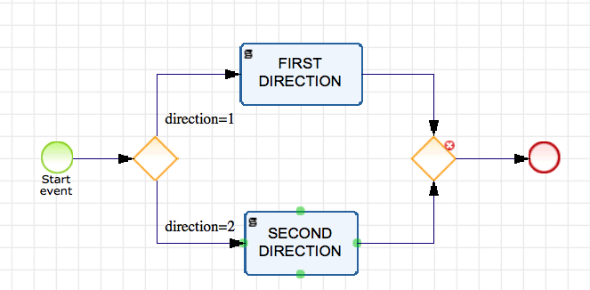
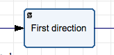
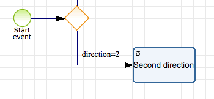

* [How to create a new user](#markdown-header-how-to-create-a-new-user)

    * [Retrieving client_secret](#markdown-header-retrieving-client_secret)

    * [Getting authorization key](#markdown-header-getting-authorization-key)

* [How to create and launch a new process](#markdown-header-how-to-create-and-launch-a-new-process)

    * [How to assign user to task](#markdown-header-how-to-assign-user-to-task)

    * [How to add objects to process](#markdown-header-how-to-add-objects-to-process)

    * [How to add flows between process objects](#markdown-header-how-to-add-flows-between-process-objects)

    * [How to delegate user to task](#markdown-header-how-to-delegate-user-to-task)

    * [How to run process](#markdown-header-how-to-run-process)

* [Example#1](#markdown-header-example1)
* [Example#2](#markdown-header-example2)

For general code examples please see below.
### How to create a new user

```php
/** Setting required attributes for user Bob*/

/** @var UserAttributes $bobAttr */
$bobAttr = new UserAttributes();
$bobAttr->setLastname('Doe');
$bobAttr->setFirstname('Bob');
$bobAttr->setUsername('Bob');
$bobAttr->setPassword('Bobpassword');
$bobAttr->setEmail('bob@processmaker.com');

    /** get client secret and ID */

    /** @var UserItem $bob */
    $bob = $apiInstance->addUser(new UserCreateItem([
        'data' => new User(['attributes' => $bobAttr])
    ]));
```

From the result you may retrieve `client_id`

`print_r($bob->getData()->getAttributes());`

This `client_id` required to obtain `client_secret` and then you will be able to perform Oauth authorization key

#### Retrieving client_secret

```php
/** Getting additional credentials to get access token for created users */
    /** @var ClientItem $bobCredentials */
    $bobCredentials = $apiInstance->findClientById($bob->getData()->getId(), $bob->getData()->getAttributes()->getClients()[0]);
    print_r($bobCredentials);
```

Here you may retrieve `client_secret`.

#### Getting authorization key

Having both `client_id` and `client_secret` you may retrieve `access_token` using *password grant*.
Additionally `username` and `password` are required to perform the operation.

```php
$args_for_bob = [
    'grant_type' => 'password',
    'client_id' => $bobCredentials->getData()->getId(),
    'client_secret' => $bobCredentials->getData()->getAttributes()->getSecret(),
    'username' => $bobAttr->getUsername(),
    'password' => $bobAttr->getPassword()
];

print_r(getCredentials($args_for_bob, $host));

/**
 * @param array $args Oauth request data
 * @param string $host API HOST
 * @return mixed
 */
function getCredentials($args, $host)
{
    $ch = curl_init();
    curl_setopt($ch, CURLOPT_URL, "https://$host/oauth/access_token");
    curl_setopt($ch, CURLOPT_POST, 1);
    curl_setopt($ch, CURLOPT_POSTFIELDS, http_build_query($args));
    curl_setopt($ch, CURLOPT_RETURNTRANSFER, true);
    $serverResponse = json_decode(curl_exec($ch));
    curl_close($ch);
    return $serverResponse;
}

```

Here you will get `access_token` and `refresh_token` to perform Oauth authorization for specific user.

## How to create and launch a new process

Executing code snippet below creates a new **Process**

```php
/** @var ProcessAttributes $processAttr */
$processAttr = new ProcessAttributes();
$processAttr->setStatus('ACTIVE');
$processAttr->setName('Example process '.$random);
$processAttr->setDurationBy('WORKING_DAYS');
$processAttr->setType('NORMAL');
$processAttr->setDesignAccess('PUBLIC');
/** @var ProcessItem $result */
$process = $apiInstance->addProcess(new ProcessCreateItem(
        [
            'data' => new Process(['attributes' => $processAttr])
        ]
    )
);

```

As result we get process_id, which we can use in future to add objects to our **Process** ``php  $process->getData()->getId();``.

### How to assign user to task

To run process, we should create new **Group** and attach existing **User** to that group
````php
/** @var GroupAddUsersItem $groupAddUserItem */
$groupAddUserItem = new GroupAddUsersItem([
     'data' => new UserIds([
         'users' => [$apiInstance->myselfUser()->getData()->getId()]
      ])
  ]);
$apiInstance->addUsersToGroup($group->getData()->getId(), groupAddUserItem);

````
### How to add objects to process
Also we should add objects to our process,  such as **Start event**  and **End event**: ``$apiInstance->addEvent()``, and at least one  **Task** object ``$apiInstance->addTask()``.

### How to add flows between process objects

All objects in **Process** need to be joined by **SEQUENTIAL** **Flows** ``$apiInstance->addFlow()`` with each other.

### How to delegate User to Task

Now we have `process id`, `task id` and `group id` and can assign **Task** to **Group** with following method:
```php
/** @var TaskAddGroupsItem $taskAddGroupsItem */
$taskAddGroupsItem = new TaskAddGroupsItem([
   'data' => new GroupIds([
      'groups' => [$group->getData()->getId()]
   ])
 ]);
$apiInstance->addGroupsToTask(
       $process->getData()->getId(),
       $userTask->getData()->getId(),
       $taskAddGroupsItem
      );

```
### How to run process

To run process we just need to trigger **Start event** object by following snippet.

```php
 /** @var array $arrayContent */
 $arrayContent = ['key' => 6, 'add' => 15, 'confirm' => false];
 /** @var DataModelAttributes $dataModelAttr */
 $dataModelAttr = new DataModelAttributes();
 $dataModelAttr->setContent(json_encode($arrayContent));
 /** @var DataModelItem $result */
 $result = $apiInstance->eventTrigger(
     $process->getData()->getId(),
     $startEvent->getData()->getId(),
     new TriggerEventCreateItem(
         [
            'data' => new DataModel(['attributes' => $dataModelAttr])
         ]
     )
 );

```

Just pass ``$process->getData()->getId()`` **Process** id and ``$startEvent->getData()->getId()`` **Start event** id and in body **Data model** any content that we need during running **Process** just putting into associative array keys and values ``$arrayContent = ['key' => 6, 'add' => 15, 'confirm' => false];``.

As result, our engine creates **Process instance** with status **RUNNING**.
To get all instances belonging to **Process** you can retrieve using ``$apiInstance->findInstances($process->getData()->getId())`` method.


## How to use Exclusive gateway and conditional flows (2 examples)

### Example #1

In Example#1 implemented **Process** showed below:



**Process** has **Exclusive** and **Inclusive** gateways and one **End event**.

First of all create **Process** and fill it with objects.

### Create **Process**

```php
/** @var ProcessAttributes $processAttr */
$processAttr = new ProcessAttributes();
$processAttr->setStatus('ACTIVE');
$processAttr->setName('Example process');
$processAttr->setDurationBy('WORKING_DAYS');
$processAttr->setType('NORMAL');
$processAttr->setDesignAccess('PUBLIC');
/** @var ProcessItem $result */
$process = $apiInstance->addProcess(new ProcessCreateItem(
        [
            'data' => new Process(['attributes' => $processAttr])
        ]
   )
);

```

### Create **Start event**


```php
/** @var EventCreateItem $eventAttr */
$eventAttr = new EventAttributes();
$eventAttr->setName('Start event');
$eventAttr->setType('START');
$eventAttr->setProcessId($process->getData()->getId());
$eventAttr->setDefinition('MESSAGE');
/** @var EventItem $startEvent */
$startEvent = $apiInstance->addEvent(
    $process->getData()->getId(),
    new EventCreateItem(
        [
           'data' => new Event(['attributes' => $eventAttr])
        ]
    )
);

```

### Create **End event**


```php
/** @var EventCreateItem $eventAttr */
$eventAttr = new EventAttributes();
$eventAttr->setName('End event');
$eventAttr->setType('END');
$eventAttr->setProcessId($process->getData()->getId());
$eventAttr->setDefinition('MESSAGE');
/** @var EventItem $endEvent */
$endEvent = $apiInstance->addEvent(
    $process->getData()->getId(),
    new EventCreateItem(
        [
            'data' => new Event(['attributes' => $eventAttr])
        ]
    )
);

```

### Create two script tasks
Code snippet below creates two script tasks, which do simple things, just to add 2 types of variables to our **Data model** during running **Process**




```php
/** @var TaskAttributes $taskAttr */
$taskAttr = new TaskAttributes();
$taskAttr->setName('First direction');
$taskAttr->setType('SCRIPT-TASK');
$taskAttr->setProcessId($process->getData()->getId());
$taskAttr->setAssignType('CYCLIC');
$taskAttr->setScript('$aData[\'First_Direction\'] = 1;');
/** @var TaskItem $result */
$firstDirectTask = $apiInstance->addTask(
    $process->getData()->getId(),
    new TaskCreateItem(
       [
           'data' => new Task(['attributes' => $taskAttr])
       ]
    )
);
```


```php
/** @var TaskAttributes $taskAttr */
$taskAttr = new TaskAttributes();
$taskAttr->setName('Second direction');
$taskAttr->setType('SCRIPT-TASK');
$taskAttr->setProcessId($process->getData()->getId());
$taskAttr->setAssignType('CYCLIC');
$taskAttr->setScript('$aData[\'Second_Direction\'] = 2;');

/** @var TaskItem $result */
$secondDirectTask = $apiInstance->addTask(
    $process->getData()->getId(),
    new TaskCreateItem(
        [
            'data' => new Task(['attributes' => $taskAttr])
        ]
    )
);

```

## Create two types of gateways: Exclusive and Inclusive.


```php
/** @var GatewayAttributes $gatewayAttr */
$gatewayAttr = new GatewayAttributes();
$gatewayAttr->setName('Exclusive gateway');
$gatewayAttr->setType('EXCLUSIVE');
$gatewayAttr->setDirection('DIVERGENT');
$gatewayAttr->setProcessId($process->getData()->getId());

/** @var GatewayItem $exclusiveGateway */
$exclusiveGateway = $apiInstance->addGateway(
    $process->getData()->getId(),
    new GatewayCreateItem(
        [
            'data' => new Gateway(['attributes' => $gatewayAttr])
        ]
    )
);

```


```php
/** @var GatewayAttributes $gatewayAttr */
$gatewayAttr = new GatewayAttributes();
$gatewayAttr->setName('Exclusive gateway');
$gatewayAttr->setType('EXCLUSIVE');
$gatewayAttr->setDirection('CONVERGENT');
$gatewayAttr->setProcessId($process->getData()->getId());
/** @var GatewayItem $inclusiveGateway */
$inclusiveGateway = $apiInstance->addGateway(
    $process->getData()->getId(),
    new GatewayCreateItem(
        [
           'data' => new Gateway(['attributes' => $gatewayAttr])
        ]
    )
);

```
### Create SEQUENTIAL flows between objects


```php
/** @var FlowAttributes $flowAttr */
$flowAttr= new FlowAttributes();
$flowAttr->setName('Flow StartEvent with Exclusive Gateway');
$flowAttr->setType('SEQUENTIAL');
$flowAttr->setProcessId($process->getData()->getId());
$flowAttr->setFromObjectId($startEvent->getData()->getId());
$flowAttr->setFromObjectType($startEvent->getData()->getType());
$flowAttr->setToObjectId($exclusiveGateway->getData()->getId());
$flowAttr->setToObjectType($exclusiveGateway->getData()->getType());
$apiInstance->addFlow(
        $process->getData()->getId(),
        new FlowCreateItem([
            'data' => new Flow(['attributes' => $flowAttr])
        ])
    );

/** @var FlowAttributes $flowAttr */
$flowAttr= new FlowAttributes();
$flowAttr->setName('Flow FirstDirection with Inclusive Gateway');
$flowAttr->setType('SEQUENTIAL');
$flowAttr->setProcessId($process->getData()->getId());
$flowAttr->setFromObjectId($firstDirectTask->getData()->getId());
$flowAttr->setFromObjectType($firstDirectTask->getData()->getType());
$flowAttr->setToObjectId($inclusiveGateway->getData()->getId());
$flowAttr->setToObjectType($inclusiveGateway->getData()->getType());
$apiInstance->addFlow(
        $process->getData()->getId(),
        new FlowCreateItem([
            'data' => new Flow(['attributes' => $flowAttr])
        ])
    );

/** @var FlowAttributes $flowAttr */
$flowAttr= new FlowAttributes();
$flowAttr->setName('Flow SecondDirection with Inclusive Gateway');
$flowAttr->setType('SEQUENTIAL');
$flowAttr->setProcessId($process->getData()->getId());
$flowAttr->setFromObjectId($secondDirectTask->getData()->getId());
$flowAttr->setFromObjectType($secondDirectTask->getData()->getType());
$flowAttr->setToObjectId($inclusiveGateway->getData()->getId());
$flowAttr->setToObjectType($inclusiveGateway->getData()->getType());
$apiInstance->addFlow(
        $process->getData()->getId(),
        new FlowCreateItem([
           'data' => new Flow(['attributes' => $flowAttr])
        ])
    );

/** @var FlowAttributes $flowAttr */
$flowAttr= new FlowAttributes();
$flowAttr->setName('Flow Inclusive Gateway with end Event');
$flowAttr->setType('SEQUENTIAL');
$flowAttr->setProcessId($process->getData()->getId());
$flowAttr->setFromObjectId($inclusiveGateway->getData()->getId());
$flowAttr->setFromObjectType($inclusiveGateway->getData()->getType());
$flowAttr->setToObjectId($endEvent->getData()->getId());
$flowAttr->setToObjectType($endEvent->getData()->getType());
$apiInstance->addFlow(
       $process->getData()->getId(),
       new FlowCreateItem([
            'data' => new Flow(['attributes' => $flowAttr])
       ])
   );

```

### Create two SEQUENTIAL flows with conditions


```php

/** @var FlowAttributes $flowAttr */
$flowAttr= new FlowAttributes();
$flowAttr->setName('Flow Exclusive Gateway with First direction');
$flowAttr->setType('SEQUENTIAL');
$flowAttr->setProcessId($process->getData()->getId());
$flowAttr->setFromObjectId($exclusiveGateway->getData()->getId());
$flowAttr->setFromObjectType($exclusiveGateway->getData()->getType());
$flowAttr->setToObjectId($firstDirectTask->getData()->getId());
$flowAttr->setToObjectType($firstDirectTask->getData()->getType());
$flowAttr->setCondition('direction=1');
$apiInstance->addFlow(
       $process->getData()->getId(),
       new FlowCreateItem([
            'data' => new Flow(['attributes' => $flowAttr])
       ])
   );

```




```php
/** @var FlowAttributes $flowAttr */
$flowAttr= new FlowAttributes();
$flowAttr->setName('Flow Exclusive Gateway with Second direction');
$flowAttr->setType('SEQUENTIAL');
$flowAttr->setProcessId($process->getData()->getId());
$flowAttr->setFromObjectId($exclusiveGateway->getData()->getId());
$flowAttr->setFromObjectType($exclusiveGateway->getData()->getType());
$flowAttr->setToObjectId($secondDirectTask->getData()->getId());
$flowAttr->setToObjectType($secondDirectTask->getData()->getType());
$flowAttr->setCondition('direction=2');
$apiInstance->addFlow(
        $process->getData()->getId(),
        new FlowCreateItem([
            'data' => new Flow(['attributes' => $flowAttr])
        ])
    );

```

### Run Process with random data - `['direction' => rand(1,2)]` in  Data model

```php
/** @var array $arrayContent */
$arrayContent = ['direction' => rand(1,2)];
/** @var DataModelAttributes $dataModelAttr */
$dataModelAttr = new DataModelAttributes();
$dataModelAttr->setContent(json_encode($arrayContent));
/** @var DataModelItem $result */
$result = $apiInstance->eventTrigger(
    $process->getData()->getId(),
    $startEvent->getData()->getId(),
    new TriggerEventCreateItem(
        [
            'data' => new DataModel(['attributes' => $dataModelAttr])
        ]
    )
);

```

As result engine will run **Process** and creates **Process instance** and lead it through **Process** and finishes with status **COMPLETE**, which can be retrieved:
```php
/** @var InstanceCollection $instances */
$instances = $apiInstance->findInstances($process->getData()->getId());

```
Direction of our **Process instance** will be showed in **Data model** :

```php
$apiInstance->findDataModel(
            $process->getData()->getId(),
            $instances->getData()[0]->getId()
        );

```
Inside **Data model** you can find array with `['First_Direction'] = 1` or  `['Second_Direction'] = 2` depending on data, that have been passed to **Start event** trigger.

### Example2

In Example#2 implemented **Process** showed below:


**Process** has just **Exclusive** gateway and two **End events**.

First of all create **Process** and fill it with objects.

### Create **Process**

```php
/** @var ProcessAttributes $processAttr */
$processAttr = new ProcessAttributes();
$processAttr->setStatus('ACTIVE');
$processAttr->setName('Example process');
$processAttr->setDurationBy('WORKING_DAYS');
$processAttr->setType('NORMAL');
$processAttr->setDesignAccess('PUBLIC');
/** @var ProcessItem $result */
$process = $apiInstance->addProcess(new ProcessCreateItem(
        [
            'data' => new Process(['attributes' => $processAttr])
        ]
   )
);

```

### Create **Start event**


```php
/** @var EventCreateItem $eventAttr */
$eventAttr = new EventAttributes();
$eventAttr->setName('Start event');
$eventAttr->setType('START');
$eventAttr->setProcessId($process->getData()->getId());
$eventAttr->setDefinition('MESSAGE');
/** @var EventItem $startEvent */
$startEvent = $apiInstance->addEvent(
    $process->getData()->getId(),
    new EventCreateItem(
        [
           'data' => new Event(['attributes' => $eventAttr])
        ]
    )
);

```

### Create two **End events**


```php
/** @var EventCreateItem $eventAttr */
$eventAttr = new EventAttributes();
$eventAttr->setName('End event');
$eventAttr->setType('END');
$eventAttr->setProcessId($process->getData()->getId());
$eventAttr->setDefinition('MESSAGE');
/** @var EventItem $endEvent */
$endEvent = $apiInstance->addEvent(
    $process->getData()->getId(),
    new EventCreateItem(
        [
            'data' => new Event(['attributes' => $eventAttr])
        ]
    )
);

```


```php
/** @var EventCreateItem $eventAttr */
$eventAttr = new EventAttributes();
$eventAttr->setName('End event2');
$eventAttr->setType('END');
$eventAttr->setProcessId($process->getData()->getId());
$eventAttr->setDefinition('MESSAGE');
/** @var EventItem $endEvent2 */
$endEvent2 = $apiInstance->addEvent(
    $process->getData()->getId(),
    new EventCreateItem(
        [
           'data' => new Event(['attributes' => $eventAttr])
        ]
    )
);

```

### Create two script tasks
Code snippet below creates two script tasks, which do simple things just to add 2 types of variables to our **Data model**


```php
/** @var TaskAttributes $taskAttr */
$taskAttr = new TaskAttributes();
$taskAttr->setName('First direction');
$taskAttr->setType('SCRIPT-TASK');
$taskAttr->setProcessId($process->getData()->getId());
$taskAttr->setAssignType('CYCLIC');
$taskAttr->setScript('$aData[\'First_Direction\'] = 1;');
/** @var TaskItem $result */
$firstDirectTask = $apiInstance->addTask(
    $process->getData()->getId(),
    new TaskCreateItem(
       [
           'data' => new Task(['attributes' => $taskAttr])
       ]
    )
);
```


```php
/** @var TaskAttributes $taskAttr */
$taskAttr = new TaskAttributes();
$taskAttr->setName('Second direction');
$taskAttr->setType('SCRIPT-TASK');
$taskAttr->setProcessId($process->getData()->getId());
$taskAttr->setAssignType('CYCLIC');
$taskAttr->setScript('$aData[\'Second_Direction\'] = 2;');
/** @var TaskItem $result */
$secondDirectTask = $apiInstance->addTask(
    $process->getData()->getId(),
    new TaskCreateItem(
        [
            'data' => new Task(['attributes' => $taskAttr])
        ]
    )
);

```

### Create SEQUENTIAL flows between objects


```php
/** @var FlowAttributes $flowAttr */
$flowAttr= new FlowAttributes();
$flowAttr->setName('Flow StartEvent with Exclusive Gateway');
$flowAttr->setType('SEQUENTIAL');
$flowAttr->setProcessId($process->getData()->getId());
$flowAttr->setFromObjectId($startEvent->getData()->getId());
$flowAttr->setFromObjectType($startEvent->getData()->getType());
$flowAttr->setToObjectId($exclusiveGateway->getData()->getId());
$flowAttr->setToObjectType($exclusiveGateway->getData()->getType());
$apiInstance->addFlow(
        $process->getData()->getId(),
        new FlowCreateItem([
           'data' => new Flow(['attributes' => $flowAttr])
        ])
    );

/** @var FlowAttributes $flowAttr */
$flowAttr= new FlowAttributes();
$flowAttr->setName('Flow FirstDirection with End event');
$flowAttr->setType('SEQUENTIAL');
$flowAttr->setProcessId($process->getData()->getId());
$flowAttr->setFromObjectId($firstDirectTask->getData()->getId());
$flowAttr->setFromObjectType($firstDirectTask->getData()->getType());
$flowAttr->setToObjectId($endEvent->getData()->getId());
$flowAttr->setToObjectType($endEvent->getData()->getType());
$apiInstance->addFlow(
        $process->getData()->getId(),
        new FlowCreateItem([
            'data' => new Flow(['attributes' => $flowAttr])
        ])
    );

/** @var FlowAttributes $flowAttr */
$flowAttr= new FlowAttributes();
$flowAttr->setName('Flow SecondDirection to Endevent2');
$flowAttr->setType('SEQUENTIAL');
$flowAttr->setProcessId($process->getData()->getId());
$flowAttr->setFromObjectId($secondDirectTask->getData()->getId());
$flowAttr->setFromObjectType($secondDirectTask->getData()->getType());
$flowAttr->setToObjectId($endEvent2->getData()->getId());
$flowAttr->setToObjectType($endEvent2->getData()->getType());
$apiInstance->addFlow(
        $process->getData()->getId(),
        new FlowCreateItem([
            'data' => new Flow(['attributes' => $flowAttr])
        ])
    );

```

### Create two SEQUENTIAL flows with conditions


```php

/** @var FlowAttributes $flowAttr */
$flowAttr= new FlowAttributes();
$flowAttr->setName('Flow Exclusive Gateway with First direction');
$flowAttr->setType('SEQUENTIAL');
$flowAttr->setProcessId($process->getData()->getId());
$flowAttr->setFromObjectId($exclusiveGateway->getData()->getId());
$flowAttr->setFromObjectType($exclusiveGateway->getData()->getType());
$flowAttr->setToObjectId($firstDirectTask->getData()->getId());
$flowAttr->setToObjectType($firstDirectTask->getData()->getType());
$flowAttr->setCondition('direction=1');
$apiInstance->addFlow(
       $process->getData()->getId(),
       new FlowCreateItem([
            'data' => new Flow(['attributes' => $flowAttr])
       ])
   );

```


```php
/** @var FlowAttributes $flowAttr */
$flowAttr= new FlowAttributes();
$flowAttr->setName('Flow Exclusive Gateway with Second direction');
$flowAttr->setType('SEQUENTIAL');
$flowAttr->setProcessId($process->getData()->getId());
$flowAttr->setFromObjectId($exclusiveGateway->getData()->getId());
$flowAttr->setFromObjectType($exclusiveGateway->getData()->getType());
$flowAttr->setToObjectId($secondDirectTask->getData()->getId());
$flowAttr->setToObjectType($secondDirectTask->getData()->getType());
$flowAttr->setCondition('direction=2');
$apiInstance->addFlow(
        $process->getData()->getId(),
        new FlowCreateItem([
            'data' => new Flow(['attributes' => $flowAttr])
        ])
    );

```

### Run Process with random data - `['direction' => rand(1,2)]` in  Data model

```php
/** @var array $arrayContent */
$arrayContent = ['direction' => rand(1,2)];
/** @var DataModelAttributes $dataModelAttr */
$dataModelAttr = new DataModelAttributes();
$dataModelAttr->setContent(json_encode($arrayContent));
/** @var DataModelItem $result */
$result = $apiInstance->eventTrigger(
    $process->getData()->getId(),
    $startEvent->getData()->getId(),
    new TriggerEventCreateItem(
        [
            'data' => new DataModel(['attributes' => $dataModelAttr])
        ]
    )
);

```

As result engine will run **Process** and creates **Process instance** with status **COMPLETE**, which we can retrieve:
```php
/** @var InstanceCollection $instances */
$instances = $apiInstance->findInstances($process->getData()->getId());

```
Direction of our **Process instance** will be showed in **Data model** :

```php
$apiInstance->findDataModel(
            $process->getData()->getId(),
            $instances->getData()[0]->getId()
        );

```
Inside **Data model** you can find array with `['First_Direction'] = 1` or  `['Second_Direction'] = 2` depending on data, that have been passed to **Start event** trigger.

All examples described above, you can find in this repository.